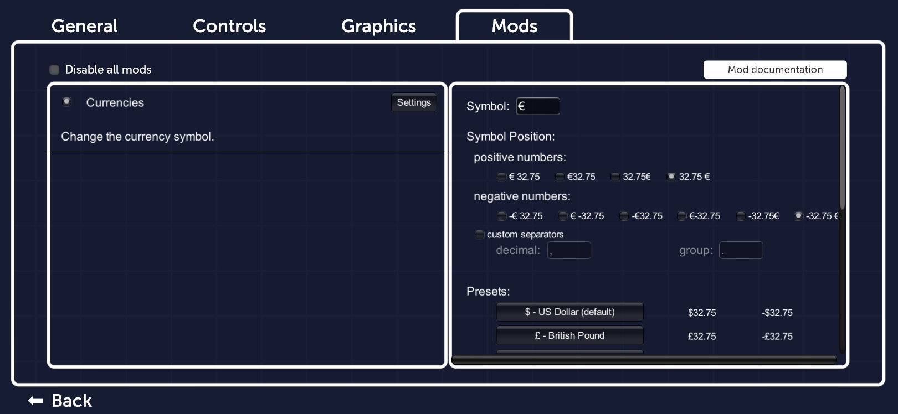

Currencies
===============
Mod for [Parkitect](http://themeparkitect.com/).

Change the currency symbol.  
Parkitect displays money as Dollars marked by *$*. With this mod you can change the symbol to other representations like *€* or *£*.  

Besides just exchanging the symbol, you can also control where to put it to match a regional preference: While the default US-dollar style is *$123.12*, the German preference (with Euro) is *123.12 €* [*](#star1).  

  
## Installation
* Steam: Just subscribe to this mod on the Steam Workshop.
* Other:
  * Download the newest version of this mod from the [release page on GitHub](https://github.com/Craxy/Parkitect-Currencies/releases).
  * Extract the zip file into `{MyDocuments}/Parkitect/Mods/`.

## Settings 

### Symbols
The symbol can be any sequence of characters between a length of 0 and 3. Ergo no symbol at all up to ISO 4217 codes (like EUR or USD). However it is not recommended to use a symbol longer than 1 character: Longer symbols might not fit in their fixed position and might stick out or even change the layout of a window.  

The list of available characters in game is rather limited.  
Unfortunately the settings menu uses a different font display than ingame. Therefore some symbols might be displayed in the settings, but not in the game. In that case a warning is shown:
  
If you keep a missing symbol it will show up as a box in game:  
  

The default Parkitect font supports just the most common currency symbols like $, € and £. For more options this mod injects a couple additional currency symbols like ₽ (Ruble) or ₩ (Won). If there's a symbol missing you would like to use, best request it as a [issue on github](https://github.com/Craxy/Parkitect-Currencies/issues).

The injected symbols use a different font ([*Roboto*](https://fonts.google.com/specimen/Roboto)) than Parkitect (*Museo*). Therefore the injected symbols look slightly different in style -- but they are strange symbols, so it shouldn't be no noticeable.

### Symbol position
The Symbol can either be positioned before or after the number. Additional there might be an additional space between the currency symbol and the value. The possible representations are: € 123.12, €123.12, 123.12€, 123.12 €  
For negative values there are even more possible positions because of the negative sign: 
-€ 123.12, € -123.12, €-123.12, -€123.12, -123.12€, -123.12 €  

  
**Note**: The change is purely cosmetic: $123.12 = 123.12 € = £123.12 = ¥123.12 = R 123.12 -- there's no currency conversion.

**Note**: The updated currency applies once a game is loaded. It doesn't show up in the main menu.

**Note**: If you change the currency symbol while in game (via the pause/*ESC* menu): The displays with a currency symbol only update to the new one when their text gets updated by Parkitect. That might not be immediately but after certain actions like a new month (-> statistics get updated) or not at all during the current session because the text were cached (this happens in the Finances window with past monthly reports).  
**It is therefore recommended to save your current park and reload it to force the new symbol to update everywhere!**

  
  

### Release notes
Listed in [RELEASE_NOTES.md](./RELEASE_NOTES.md) and on the [release page](https://github.com/Craxy/Parkitect-Currencies/releases).  
A simplified changelog can also be found in the Change Notes page on the Steam Workshop page for this page.

### Issues
Please report issues via the [issue tracker on GitHub](https://github.com/Craxy/Parkitect-Currencies/issues).  
If this mod is responsible for a crash or an error/exception please include your *output_log.txt*. Copy this log file immediately after the crash -- its content is cleared for each Parkitect start.  

*output_log.txt* is Parkitects log file, located at 
* Windows: `%USERPROFILE%\AppData\LocalLow\Texel Raptor\Parkitect\output_log.txt`
* Linux: `~/.config/unity3d/Texel Raptor/Parkitect/Player.log`
* Mac: `~/Library/Logs/Unity/Player.log`

### Source code
[Craxy/Parkitect-Currencies on GitHub](https://github.com/Craxy/Parkitect-Currencies)

  
  
*: There are more differences between the US and DE currency presentation like the decimal separator (*123.12* vs *123,12*). This mod uses always the US version. Although it could be changed for most money displays, there are locations where this isn't possible (in money input fields like changing the fee of a ride). Additionally all other (not currency) number displays would still be in US style. [↩](#star1-source)
